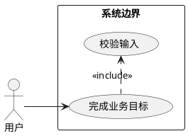
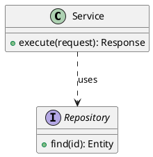
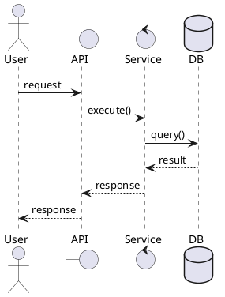
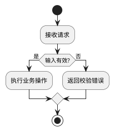
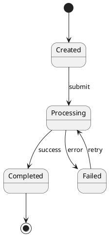
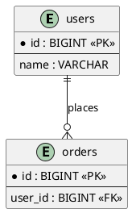

# PlantUML 建模约定

## 通用要求

- 每个文件只有一个 `@startuml` 和一个 `@enduml`。
- 图中只放能帮助回答当前问题的信息；复杂项目按领域或场景拆图。
- 关系标签使用简短动词，例如 `calls`、`contains`、`implements`、`reads`。
- 推断关系用虚线并标注 `inferred`，例如 `A ..> B : inferred`。
- 无法从静态源码确认的运行时关系写在 `note` 中，不要伪造实线关系。

## 用例图

## 类图

## 时序图

## 活动图

## 状态图

## ER 图

